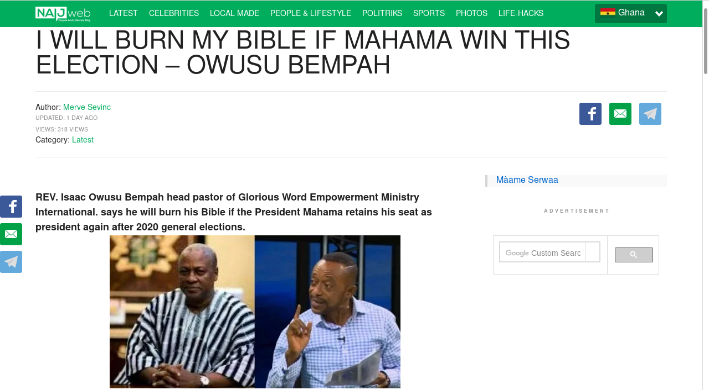

To the general and respected public, information reaching us indicates that there is a blog circulating wrong info that the church and bible of **Apostle Dr Isaac Owusu Bempah** _(Founder of The Glorious Word Chapel International)_ should be burnt if former President John Dramani Mahama does not win the 2020 Election.

We however plead the public to desist and disregard such posts and blogs since it was rather a statement made before the 2016 Election which led to the defeat of the past government and former President John Mahama. Prophet Isaac owusu Bempah still insists that the New Patriotic Party will still win the 2020 Election and Ghana will be rated as one of the best African countries. All other vital informations and prophecies which are authentic will be posted and communicated on his official pages daily.

**Thank you and God bless you.**
